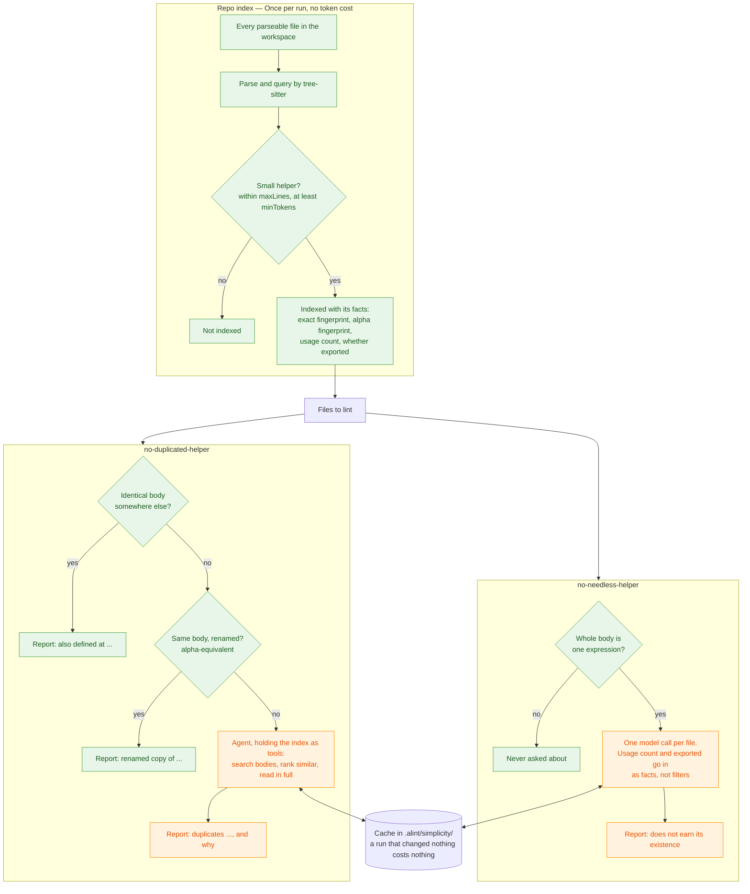

# `@alint-js/plugin-simplicity`

Tell your code to **DRY — Don't Repeat Yourself**.  
Finds small helper functions that are defined twice, or that should not exist at all.

Both rules work on **helpers**: anything with a name and a body. A function declaration,
a method, and, in TypeScript, TSX and JavaScript, an arrow function or function
expression bound to a name (`const parse = (text: string) => JSON.parse(text)`). That
last shape is how most tiny helpers are actually written, so leaving it out would hide
exactly the code these rules look for.

Languages: TypeScript, TSX, JavaScript, Rust, Go and Python.

## How it works

One index of the whole workspace, built once per run and shared by both rules. Everything
a hash can settle is settled by code. Only what is left reaches a model.



Green spends nothing. Orange spends model tokens, and only ever sees the helpers the
green half could not settle.

### The two fingerprints

Every indexed helper is hashed twice. Both hashes drop comments and collapse whitespace
first, so reformatting a copy or rewording its documentation changes neither.

**The exact fingerprint** hashes what is left, verbatim. Two helpers that share it are the
same code, character for character, once layout and comments are set aside.

**The alpha fingerprint** goes one step further: every name the helper *declares* — its own
name, its parameters, its locals — is replaced by a placeholder, in order of first
appearance. Everything the helper merely *refers to* stays as written: the functions it
calls, the types it names, the properties it reads.

That split is the whole design. A copy can rename what it declares; it cannot rename what
it refers to and still be a copy. So these two match:

```ts
function hasErrorCode(failure: unknown): failure is NodeJS.ErrnoException {
  return failure instanceof Error && 'code' in failure
}

function isNodeError(error: unknown): error is NodeJS.ErrnoException {
  return error instanceof Error && 'code' in error
}
```

Both normalize to the same thing, so the second is reported as a renamed copy of the first:

```
function $0($1: unknown): $1 is NodeJS.ErrnoException { return $1 instanceof Error && 'code' in $1 }
```

`Error` and `NodeJS.ErrnoException` survive, because the helper only refers to them. And
these two do **not** match:

```ts
export function readName(entry: Entry): string {
  return entry.name
}

export function readSize(entry: Entry): number {
  return entry.size
}
```

`entry` is declared, so it is blinded; `name` and `size` are properties the helpers read,
so they survive the hash and tell the two apart. A detector that blinded every identifier
instead — NiCad's blind renaming, PMD's `--ignore-identifiers` — collapses this pair and
reports two unrelated accessors as copies.

Matching alpha fingerprints mean the helpers are **alpha-equivalent**: identical up to
renaming. It is an equivalence, not a similarity score, so there is no threshold to tune
and no false-positive rate to trade off. Everything it cannot decide is the agent's
question.

## Rules

- **`simplicity/no-duplicated-helper`**: a small helper is defined in two or more places.
- **`simplicity/no-needless-helper`**: a one-line helper that does not earn its existence.

Rule ids carry the prefix you give the plugin in `plugins`, which is `simplicity/` in
every example here.

## `no-duplicated-helper`

Two approaches, and the AST one spends nothing.

The **AST approach** hashes. An **identical** helper is reported by code alone, and so is a
**renamed** one: a copy that changed its own name, its parameters and its locals, but not the
functions it calls, the types it names or the properties it reads. Those are the names a copy
cannot change and stay a copy, so they are left in the hash, and they are also what keeps
`return this.name` and `return this.size` from being mistaken for each other. This is
alpha-equivalence, and because it is an equivalence rather than a score there is no
threshold to tune.

Everything a hash cannot settle goes to the **agentic approach**. The agent is not handed a
shortlist: it gets the index as tools and searches the way a reviewer would, saying what a
helper does, searching other bodies for that behaviour (`search_helper_bodies` looks for
`instanceof Error`, not for names), reading the candidates in full, and deciding.

A finding names the twin and the responsibility they share, and stops there:

```
Helper "isNodeErrorCode" duplicates "isNodeError" at ts/store.ts:16:
  Both ask whether an error has a specific Node error code.
```

It does not suggest where the shared copy should live. That decision depends on
ownership, layering and dependency direction, none of which this rule looks at; see
`docs/simplicity-architecture.md` for the version that tried and what it produced.

## `no-needless-helper`

A helper earns its existence when its interface is simpler than its implementation, when
the name tells a reader something the body would not. This rule reports the ones that do
not: a body of a single expression that says what the name says, so a reader jumps to the
declaration to learn nothing.

```
Helper "parse" does not earn its existence: Forwards to JSON.parse unchanged.
```

**It has no AST approach, and cannot have one.** A hash can prove a duplicate, because two
identical bodies are a fact. Nothing can prove a helper *should not exist*, because that
is a judgement about a reader. So the deterministic half finds the helpers worth asking
about (one expression, no more) and gathers the facts a judgement needs: how often the
helper is called, and whether it is somebody's public API. Those go to the model as
**facts, not filters**. A helper called forty times is not disqualified by code; the model
is told the number and left to weigh it.

What it must *not* report matters as much as what it must:

- **`clamp(value, low, high)`** is short, and earns it. The name is the documentation;
  `Math.min(Math.max(x, 0), 1)` is not.
- **`isNodeError(error): error is ErrnoException`** is a one-line type guard. Inlined, the
  check still runs but the call site loses the type it narrowed to.

That second case is the sharpest in the plugin: `no-duplicated-helper` must report
`isNodeError`, because it is copied, and `no-needless-helper` must not, because it earns
its keep. The same three lines, two rules, opposite decisions.

It costs one model call per file rather than an agent loop, because everything the
judgement needs is already in hand and there is nothing to search for.

## Usage

The rules read whole files and parse them internally, so they take plain-text targets:

```js
import simplicityPlugin from '@alint-js/plugin-simplicity'

import { createApeiraAdapter } from '@alint-js/agent-apeira'
import { defineConfig } from '@alint-js/cli'

export default defineConfig([
  {
    // `no-duplicated-helper`'s agentic approach needs this. Without it, the AST approach
    // still runs.
    agent: createApeiraAdapter(),
    files: ['**/*.{js,jsx,ts,tsx,mjs,cjs,mts,cts,rs,go,py}'],
    language: 'text/plain',
    plugins: {
      simplicity: simplicityPlugin,
    },
    rules: {
      'simplicity/no-duplicated-helper': 'warn',
      'simplicity/no-needless-helper': 'warn',
    },
    settings: {
      simplicity: {
        // Test and fixture globs to leave alone.
        ignores: ['**/*.test.ts'],
        // False keeps the AST approach and spends no tokens at all.
        judge: true,
        // The small-helper threshold, in lines. Note that it *selects* small functions;
        // every copy-paste detector uses its threshold to exclude them.
        maxLines: 10,
        // Content tokens a helper needs before it is worth a word. An empty function is
        // 3 in any language; the smallest real helper is 6.
        minTokens: 5,
      },
    },
  },
])
```

`simplicityPlugin.configs.recommended` ships the same rules and file globs, if you would
rather not spell them out.

alint rule entries carry a severity and nothing else, which is why the options live under
`settings.simplicity` rather than beside the rule.

### Cost

The agentic approach is **on by default and spends model tokens**. Identical and renamed
copies never reach it, and a file whose helpers were all settled by a hash costs nothing at
all, because no agent is started for it. `settings.simplicity.judge: false` turns the plugin
into a deterministic, zero-token duplicate detector for small helpers.

Two things keep the agentic approach affordable.

**A review is cached under a fingerprint of every helper in the workspace**, so a run that
changed nothing costs nothing. A helper added, edited, moved or deleted anywhere throws
the whole cache away, because a helper added anywhere could be the twin of a helper here,
and a decision decided against one workspace means nothing against another. The
invalidation is coarse on purpose and cheap in practice: the index holds only helpers of
ten lines or fewer, and most commits do not touch one. Turn it off with
`settings.simplicity.cache: false`.

The cache is written to `.alint/simplicity/`. Add it to your `.gitignore`: what a model
decided is not project configuration.

**Only the files you lint are reviewed.** The index always covers the whole workspace, so
a twin is found wherever it lives, but only the files you pass are handed to an agent.
That makes the cost proportional to your diff rather than to the repository:

```sh
alint $(git diff --name-only origin/main...)
```

Agent tokens are metered and reported, so a run says what it cost.

### Evaluating a change to a prompt

`fixtures/` is a graded corpus: every helper in it is either a finding a run must produce
or one it must not. The unit tests assert the parts a fingerprint decides, which cost
nothing. The parts a model decides are measured by a harness that spends real tokens, so
it is kept outside this repository and CI never runs it. See
[the architecture notes](./docs/simplicity-architecture.md) for what it measures and why a
prompt cannot be changed without it.

## When to use

- A codebase where several people, or several agents, open branches in parallel and the
  same tiny helper keeps being re-invented in each of them. This is the case the plugin
  was built from: the duplication in #28 and #31 entered through parallel branches and was
  found by a human afterwards.
- Reviews where "search for an existing implementation first" is written down as guidance
  and is not, on its own, working.
- Codebases that already run a copy-paste detector and want the band it cannot see:
  helpers below its minimum-token floor.

## When not to use

- **Not a general code-quality plugin.** The scope is function-level simplification smells
  and nothing more. If a check does not answer "does this helper exist twice" or "should
  this helper exist at all", it belongs elsewhere.
- **Not a cross-language dedupe tool.** Helpers are compared within one language only. A
  Go twin of a TypeScript helper is not shareable code, so reporting it would be advice
  nobody could take, and the tool that records findings refuses a cross-language pair
  outright.
- **Not a replacement for token-based copy-paste detectors.** jscpd, PMD's CPD and their
  peers cover large duplicated blocks (roughly 50 tokens and up) well, cheaply, and across
  150+ languages. Keep using them, and run this plugin for the small helpers they are
  configured to ignore.
- **Not free, unless you ask it to be.** The judge spends tokens. `judge: false` keeps the
  AST approach and costs nothing.
